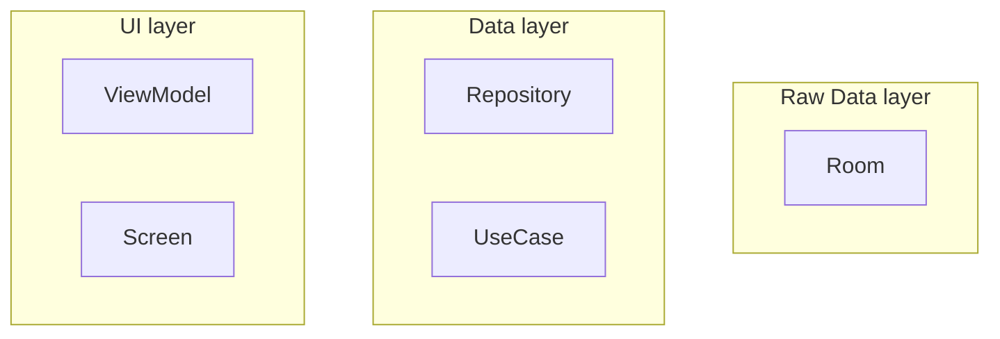
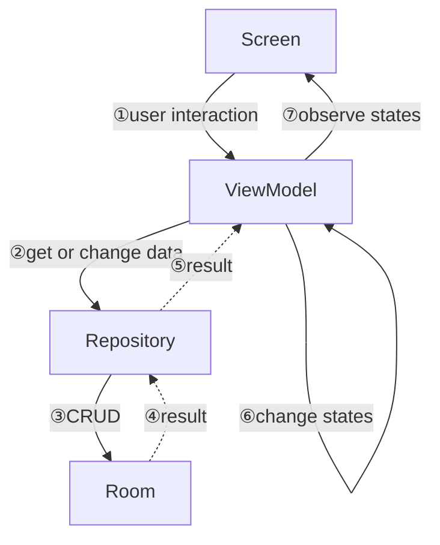
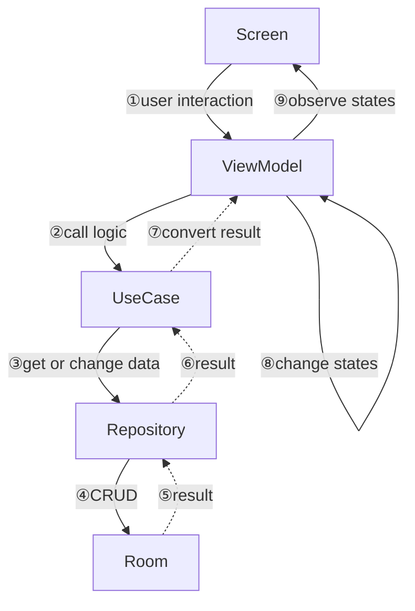
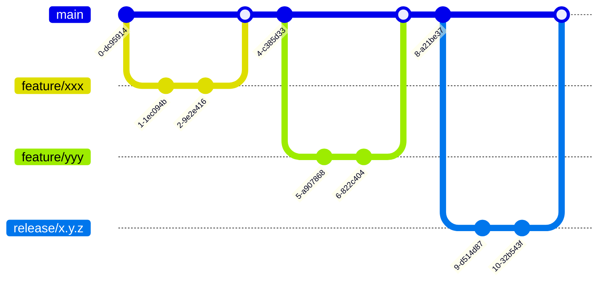

# MakaseteChoiceForAndroid

[メンバー組分けアプリまかせて☆チョイス](https://play.google.com/store/apps/details?id=io.github.emusute1212.makasetechoice&pli=1)

## UI

[Figma](https://www.figma.com/design/fwP8u8eFpNkAeQ0SVrV1qu/MakaseteChoice?node-id=39-65&t=YmBXqt0aXeCPzu2N-0)

## アーキテクチャ

[maverick](https://airbnb.io/mavericks/#/)を用いたMVIアーキテクチャを採用している。

登場人物は以下

基本的には以下のデータフローとなる

複雑なロジックが存在し、UseCaseを通す場合。

## ブランチ戦略

GitHub flowで運用している。

